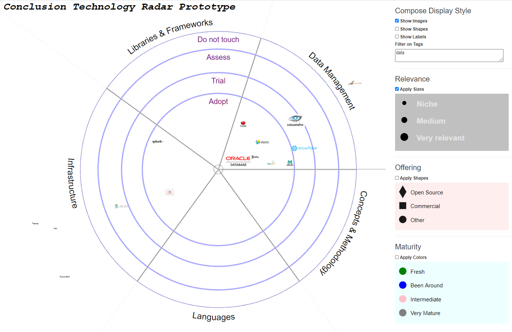
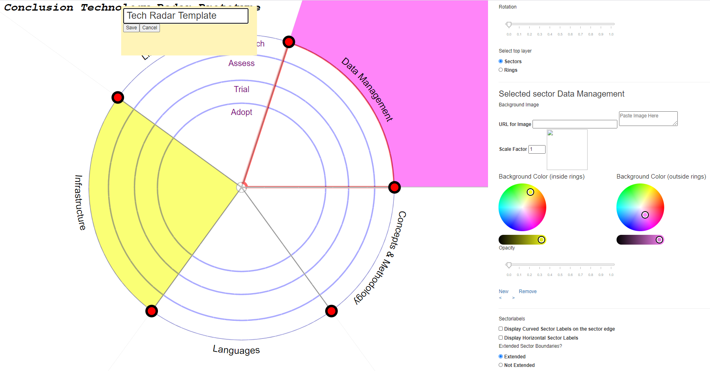

# Design of the Technology Radar 

Topics:
* Data Model
* UI structure
* Technology

## Data Model
The following diagram introduces the data model for the radar. A quick introduction:

The radar shows blips. Blips are the visual representation of an evaluation (or rating) of an object. 

### Object and Rating

An object is for example of type *technology* (such as Java or Kubernetes). Objects of type *technology* have specific properties - such as name, vendor, logo, homepage and category plus tags. The evaluation or rating of the object type *technology* is for example of rating type *technologyEvaluation*; this rating type has properties like ambition, importance, experience and scope, timestamp and author. Each property is of a specific data type (string, number, URL, image, time), it has a label and description and it can have a default value. A property may also have a limiting set of allowable values associated with it.

### Viewpoint

A radar is called a viewpoint. Each viewpoint is a mapping of ratings as blips onto a template. The template defines sectors and rings (how many, what color and label, what size, in which order) as well as additional visual dimensions (shape, size, color): which shapes, which sizes and which colors are used in the template and is the label for each of them. (for example: a template can use three sizes, four shapes and two colors; each size, shape and color has an associated label to describe its meaning)

A viewpoint is used to plot ratings of a specific rating type (and is therefore associated with objects of a specific type). A viewpoint for example plots blips for technologyEvaluations. Or blips for workitemStatus for project workitems. Associated with a viewpoint are property-visual maps; these map a property of the rating or the evaluated object to one of the visual dimensions. For example: the category property of the technology object is mapped to the sector and the ambition property of the technologyAdoption rating is mapped to the ring. And the workitem's epic property is mapped to the sector and workitem's relative size is mapped to the size dimension. The property-visual map also maps allowable values for the property to a specific element in the visual dimension. For example: the infrastructure category of technology is mapped to the second sector and the database category is mapped to fourth sector. If a workitem's epic is "epic 251", then the sector is 4. And: *if the experience property for a technologyEvaluation has the value *none* then the color it is mapped to is the first one defined in the template*.   

### Display Settings

A viewpoint has a number of display settings. These include the filter that specifies which blips for which ratings and objects should be visible, the choice between labels, shapes and/or images to be plotted for the blips, and the choice of which of the visual dimensions shapes, color and sizes should be applied (for example to toggle between just circles for all blips or shapes derived from a property value of the rating and object underpinning the blip).

Each object can be rated multiple times (at different moments in time, in different scopes, by different authors). Each rating can be visualized by a blip on a viewpoint. The same rating can be blipped in several viewpoints but not more than once per viewpoint. An object can be presented multiple times in a viewpoint but a rating only once. 

## UI Structure

The Radar application consists of a number of sections:
* the radar - the main UI that presents a viewpoint with blips (for ratings of objects) on a radar configuration; the radar can allow editing of blips 
* the radar configuration (or template) editor - for editing the visual design of the radar templates (including the sectors, rings, shapes, colors and sizes - how many, which label, what do they each look like)

* the data model manager - a tool for editing the data model that consists of the definitions of object types, rating types and properties of both including the allowable values for the properties *(not yet implemented)*
* the viewpoint wizard - a tool for creating (and refining) a viewpoint as a combination of a radar template, a rating type and a property-visual map to project object and rating properties (and specific allowable values) on visual dimensions (and specific elements in each visual dimension) *(not yet implemented)*

## Technology
The Radar is implemented as a client side only web application. It is loaded from a static web server into a browser and then runs completely in the browser. 

The Radar implementation currently uses vanilla HTML5 technologies, supported by any modern browser:
* HTML
* CSS
* JavaScript
* SVG

It also uses the *d3* library, primarily for manipulating SVG.

At present, it can upload data from a file provided by the user and load data from the local browser storage. The full dataset can be downloaded (exported) to a local file from the browser and it can be saved to local browser storage.

Currently, the application does not use a backend (API). It does not retrieve data from external URLs (except for images).